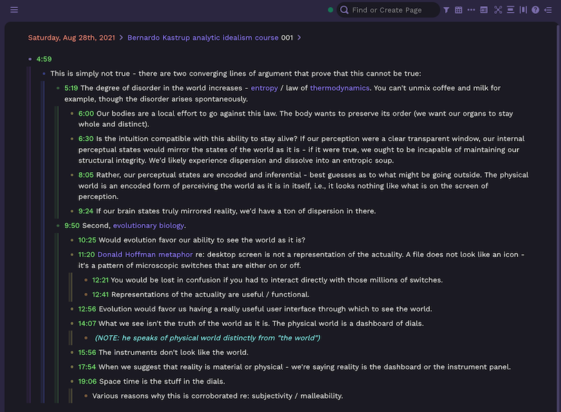
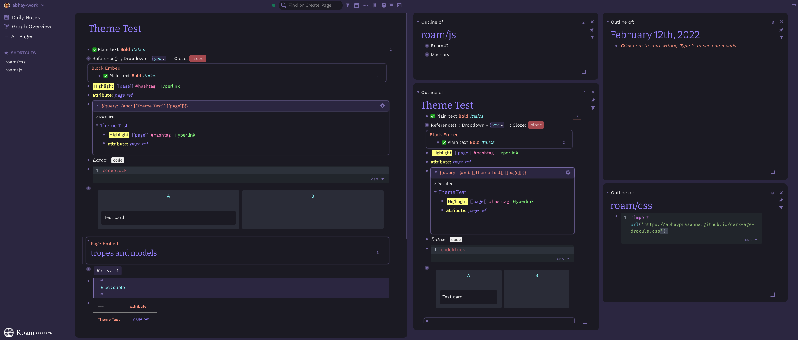
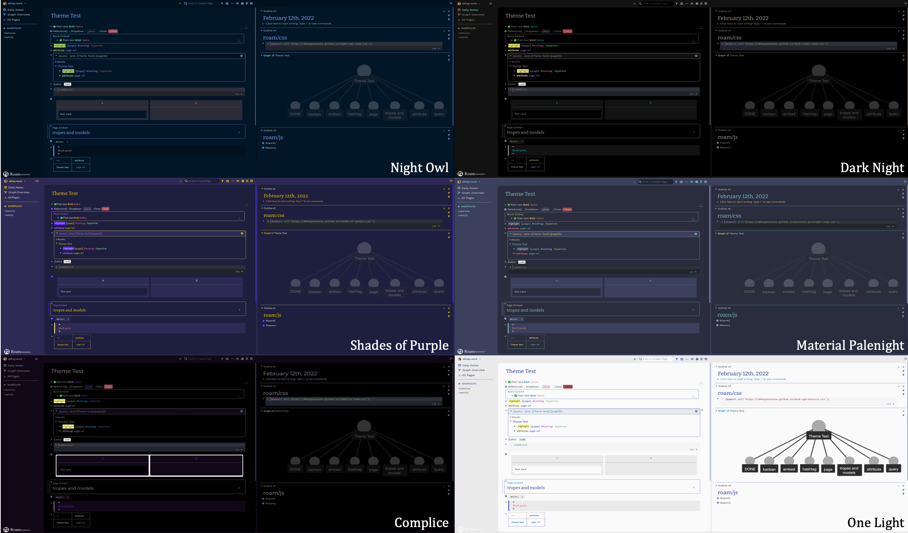

# 🧛🏿‍♂️ Better Dark Age - Dracula Pro-inspired Roam Theme

Welcome to this Dracula Pro-inspired color theme for Roam Research, which includes a ton of customizations building off @shodty's  [Dark Age theme](https://github.com/shodty/) and @linuz90's [Better Roam Research](https://github.com/linuz90/better-roam-research).

Love this theme? Say thanks via [PayPal](https://www.paypal.me/abhayprasanna) or Venmo @Abhay-Prasanna - all contributions are reinvested in the Roam community.

Other acknowledgements: Jack Laing, @Azlen, @GitMurf, Hasan Yalcinkaya, Palash Karia, and many others!

# Additional features

## 🌈 Rainbow indents

To include *rainbow indents* please add this CSS snippet (make sure @import lines are together up top)

`@import url('https://abhayprasanna.github.io/rainbow-indent-bullets.css');`

## 🧱 Masonry Mode

To apply "Masonry mode" transformation to the right sidebar, add this CSS snippet (make sure @import lines are together up top)

`@import url('https://abhayprasanna.github.io/dark-masonry.css');`
Alternatively, you can add an optional button to toggle Masonry mode for the right sidebar instead, using this custom JavaScript extension - [Toggle Masonry CSS](https://github.com/abhayprasanna/abhayprasanna.github.io/blob/master/togglecss.js)

Works on mobile too!

https://user-images.githubusercontent.com/67134545/161998251-81b29fa7-ef05-4c1a-88da-fd2c3fcc31e0.mov

## 🎨 Color Variants

There are several variants available (just import the appropriate CSS file from this folder instead). This theme also switches to One Light theme when your OS is not in Dark Mode. Feel free to customize the fonts, colors, etc.

# Instructions for Installation

**Dracula Pro**: `@import url('https://abhayprasanna.github.io/dark-age-dracula.css');`

**Night Owl**: `@import url('https://abhayprasanna.github.io/night-owl-roam.css');`

**Material Palenight** `@import url('https://abhayprasanna.github.io/material-palenight-roam.css');`

**Dark Night**: `@import url('https://abhayprasanna.github.io/dark-night-roam.css');`

**Shades of Purple**: `@import url('https://abhayprasanna.github.io/shades-of-purple.css');`

**Complice**: `@import url('https://abhayprasanna.github.io/complice-roam.css');`

If you want to make any changes, copy [this code](http://abhayprasanna.github.io/dark-age-dracula.css) and paste it into a css code block in your [[roam/css]].

This works by linking to an outside .css file, actually located [here](https://abhayprasanna.github.io/better-dark-age.css) to handle all the styling, as it keeps the roam/css page much cleaner/faster.

If you do in fact want to manipulate the source code, just [navigate to the source .css file](https://abhayprasanna.github.io/better-dark-age.css) manually, copy it, and paste it all into your roam/css page.

Here are some [optional CSS](https://github.com/abhayprasanna/abhayprasanna.github.io/blob/master/optional.css) additions and tweaks you can play with.

### How to setup your roam/css page:

[Applying custom themes in Roam Research](https://www.youtube.com/watch?v=UY-sAC2eGyI)
[Troubleshooting typical roam/css issues](https://www.loom.com/share/e7328f19276b43d48d3dbdd7e4a124d4)

Please feel free to reach out to me via Roam Slack (@abhay) or Twitter (@abhayance) if you have any questions/suggestions/requests!

Cheers!
