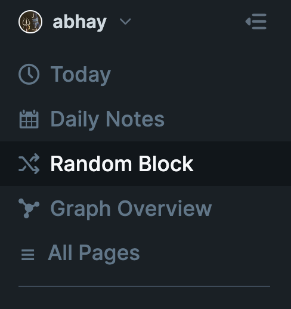

# Random Block Button ("I'm Feeling Lucky!")

## Use Case

Adds a button to the left sidebar called "Random Block". On click, this will open a random block in your graph.

This is a simple and easy way to bring some serendipity and spaced repetition into your use of Roam Research.
